# Hi there 👋

I'm a [neovimmer](https://neovim.io/) who likes to build stuff in various languages for living and fun!

Currently interested in learning more fullstack/backend web development with Golang.

Fan of assembling keyboards and collecting varios parts for them - switches,keycaps,lubes,carpets,etc. - here some i have and use daily:

